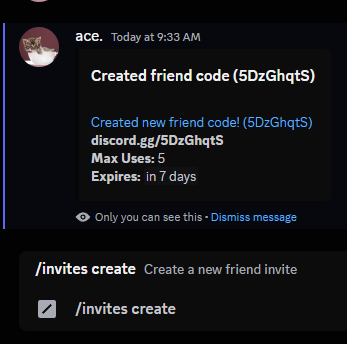
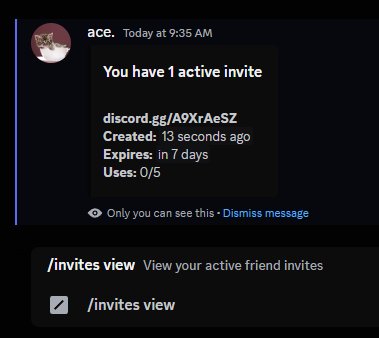
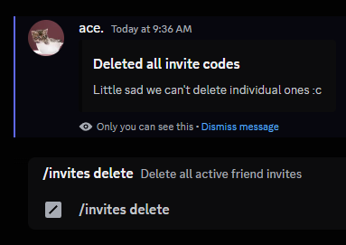
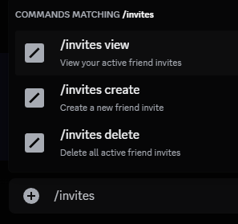

# bd-plugins

a collection of poorly written BetterDiscord plugins, or something; who knows.
might be a one-and-done type beat

### FriendInvites

**DEPRECATED**
Discord released changes which demangle exports, which makes the entire command API broken for this plugin,
I simply do not use this plugin enough to want to fix it.

Basically [vencord's](https://github.com/Vendicated/Vencord) friend-invites plugin, but for BetterDiscord.
also rips parts of Tharki's 1BunnyLib.. just minimize that region lowkey it doesn't have to be discussed

[Raw](https://raw.githubusercontent.com/AceLikesGhosts/bd-plugins/master/dist/FriendInvites.plugin.js)

| Create                                                           | View                                                         | Delete                                                           | All                                                        |
| ---------------------------------------------------------------- | ------------------------------------------------------------ | ---------------------------------------------------------------- | ---------------------------------------------------------- |
|  |  |  |  |